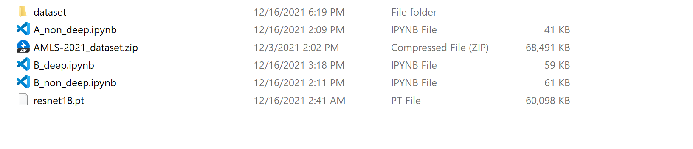

# AMLS_21-22_SN18028477

Student number: 18028477

Due to upload size limitation, only the 3 jupyter notebook files were uploaded in this reposity. The full view of the files are shown in the following picture:

The full version of this project can be downloaded from the link:
https://drive.google.com/file/d/1bPchrWNZzGEqqP2YBNBN_dDCH5JoSVFQ/view?usp=sharing

# Dataset
The dataset is the **AMLS-2021_dataset.zip** provided at http://shorturl.at/hquDP. 
Just unzip the **AMLS-2021_dataset.zip** file, the folder **dataset** will appear.
The folder **dataset** contains 3000 images and **label.csv** which gives the labels to the images.

# Jupyter Notebook files
**A_non_deep.ipynb**: Contains the SVM models (non deep learning method) for task A.
**B_non_deep.ipynb**: Contains the SVM models (non deep learning method) for task B.
**B_deep.ipynb**: Contains the Resnet18 (deep learning method) for task B. 

# Saved deep learning model
**resnet18.pt**: This file is the saved model of the resnet18 CNN model during training when running **B_deep.ipynb**.

# Required packages:
os, 
pandas, 
numpy, 
matplotlib, 
skimage, 
sklearn, 
math, 
torch, 
PIL, 
